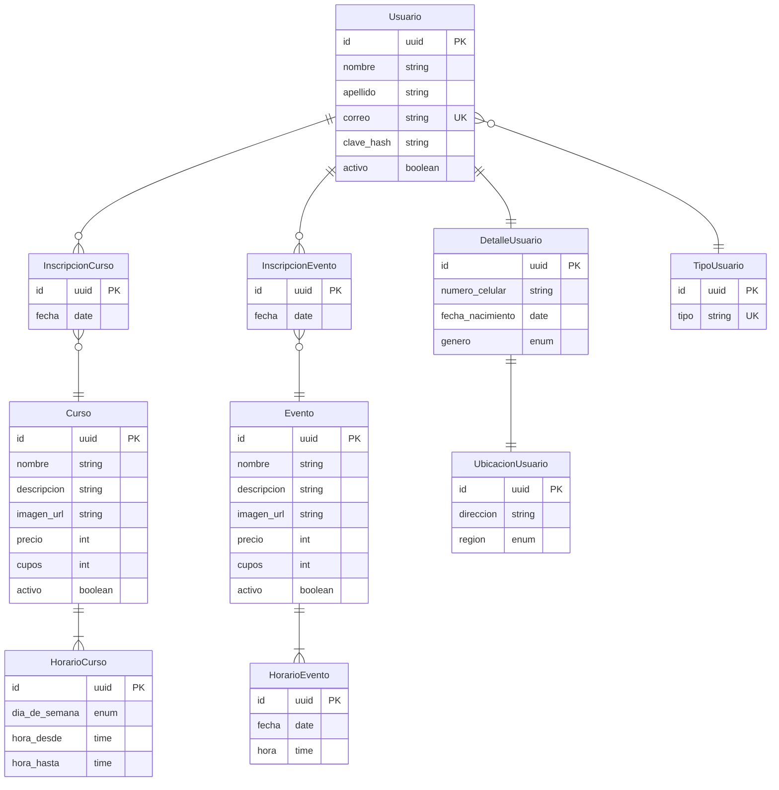

```mermaid
erDiagram

	%% Tablas Mínimas
	
	Evento {
		id uuid PK
		nombre string
		descripcion string
		imagen_url string
		precio int
		cupos int
		activo boolean
	}
	
	Usuario {
		id uuid PK
		nombre string
		apellido string
		correo string UK
		clave_hash string
		activo boolean
	}
	
	Curso {
		id uuid PK
		nombre string
		descripcion string
		imagen_url string
		precio int
		cupos int
		activo boolean
	}
	
	%% Tablas Relacionales
	
	InscripcionCurso {
		id uuid PK
		fecha date
	}
	
	InscripcionEvento {
		id uuid PK
		fecha date
	}
	
	Usuario ||--o{ InscripcionCurso : ""
	InscripcionCurso }o--|| Curso : ""
	Usuario ||--o{ InscripcionEvento : ""
	InscripcionEvento }o--|| Evento : ""
	
	%% Tablas Detalle
	
	DetalleUsuario {
		id uuid PK
		numero_celular string
		fecha_nacimiento date
		genero enum
	}
	
	UbicacionUsuario {
		id uuid PK
		direccion string
		region enum
	}
	
	TipoUsuario {
		id uuid PK
		tipo string UK
	}
	
	HorarioCurso {
		id uuid PK
		dia_de_semana enum
		hora_desde time
		hora_hasta time
	}
	
	HorarioEvento {
		id uuid PK
		fecha date
		hora time
	}
	
	Curso ||--|{ HorarioCurso : ""
	Evento ||--|{ HorarioEvento : ""
	Usuario }o--|| TipoUsuario : ""
	Usuario ||--|| DetalleUsuario : ""
	DetalleUsuario ||--|| UbicacionUsuario : ""
```